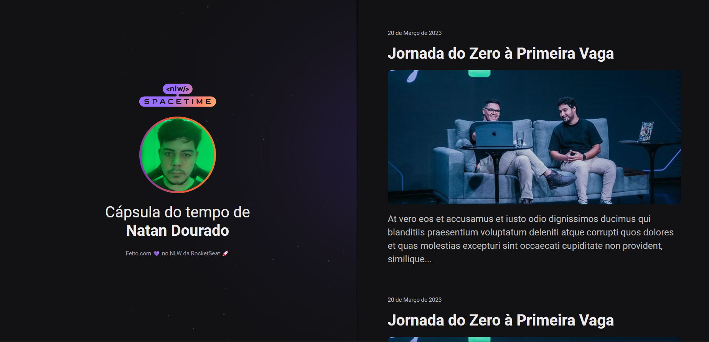

  

## 💻 Projeto
/pt-br/
Este projeto Web Reponsivo tem como objetivo ser uma cápsula do tempo para exibir memórias em uma linha do tempo.

/en-us/
This Responsive web aims to be a time capsule to show memories in a time line.

## ✅ Tecnologias
/pt-br/
Esse projeto foi desenvolvido durante o NLW da ROCKETSEAT com as seguintes tecnologias:
- HTML (HyperText Markup Language)
- CSS (Cascading Style Sheets)
- Git e Github.

/en-us/
This project was developed during the ROCKETSEAT NLW with the following technologies:
- HTML (HyperText Markup Language)
- CSS (Cascading Style Sheets)
- Git e Github.
 
